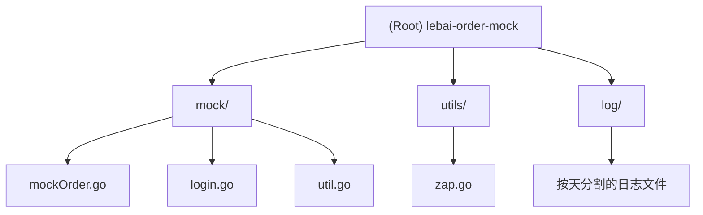

# CLAUDE.md

This file provides guidance to Claude Code (claude.ai/code) when working with code in this repository.

## 项目愿景

lebai-order-mock 是一个用于模拟餐厅订单系统的 Go 应用程序。它主要用于自动化测试订单的下单和关闭流程，在指定时间（每天 8:10）自动执行一系列模拟订单操作。

## 架构概览

这是一个简洁的 Go 单体应用，采用模块化设计：

- **定时调度系统**：主程序在指定时间触发订单模拟
- **HTTP 客户端**：与远程订单 API 进行通信
- **日志系统**：使用 Zap 进行结构化日志记录，支持按天轮转
- **环境配置**：通过 .env 文件管理配置

## 模块结构图



## 模块索引

| 模块 | 路径 | 职责 | 关键文件 |
|------|------|------|----------|
| 主程序 | `/` | 应用入口、定时调度 | `main.go` |
| 订单模拟 | `mock/` | 核心业务逻辑、API 调用 | `mockOrder.go`, `login.go` |
| 工具类 | `utils/` | 日志配置和管理 | `zap.go` |
| 日志存储 | `log/` | 日志文件存储 | `*.log` |

## 运行和开发

### 环境要求
- Go 1.25.0+
- 需要配置 `.env` 文件

### 环境变量配置
创建 `.env` 文件并设置：
```env
ORDER_URL=https://shop.lebai.ltd/api
```

### 常用命令

```bash
# 构建项目
go build -o main .

# 运行项目
go run main.go

# 安装依赖
go mod download

# 更新依赖
go mod tidy

# 查看依赖
go mod graph
```

### 部署运行
```bash
# 构建可执行文件
go build -o main .

# 后台运行
nohup ./main &

# 查看日志
tail -f log/$(date +%Y-%m-%d).log
```

## 测试策略

目前项目没有单元测试。建议添加：

- **单元测试**：针对 `mock` 包中的函数
- **集成测试**：测试完整的订单流程
- **API 测试**：模拟网络请求和响应

## 编码标准

- **包命名**：使用小写字母，避免下划线
- **变量命名**：使用驼峰命名法
- **错误处理**：所有错误都要适当处理和记录
- **日志记录**：使用结构化日志（Zap）
- **代码注释**：关键函数和复杂逻辑需要注释

## AI 使用指南

### 关键概念
- **定时执行**：程序在每天 8:10 自动触发订单模拟
- **订单流程**：下单 → 等待 10 秒 → 关闭订单
- **API 端点**：
  - 下单：`/robotapi/order/add`
  - 关闭订单：`/robotapi/order/close`
  - 登录：`/auth/signin`

### 核心数据结构
```go
// 订单请求
type OrderRequest struct {
    Dealer   string    `json:"dealer"`
    Products []Product `json:"products"`
    Amount   float64   `json:"amount"`
    PayType  string    `json:"pay_type"`
}

// 产品信息
type Product struct {
    ProductId string `json:"product_id"`
    Name      string `json:"name"`
    Quantity  int    `json:"quantity"`
}
```

### 常见操作
- **修改模拟数据**：编辑 `mock/mockOrder.go` 中的 `allNeedMockData` 变量
- **调整执行时间**：修改 `main.go` 中的时间检查逻辑
- **查看运行日志**：检查 `log/` 目录下的日志文件
- **修改日志配置**：编辑 `utils/zap.go`

### 注意事项
- 程序启动后会在 3031 端口提供 HTTP 服务（虽然没有路由处理）
- 日志文件按天分割，最多保留 30 天
- 订单 URL 通过环境变量配置，支持不同环境部署

## 变更日志

### 最近更新
- 添加了 Zap 日志框架并支持按天分割
- 实现了定时任务调度功能
- 完善了错误处理和日志记录